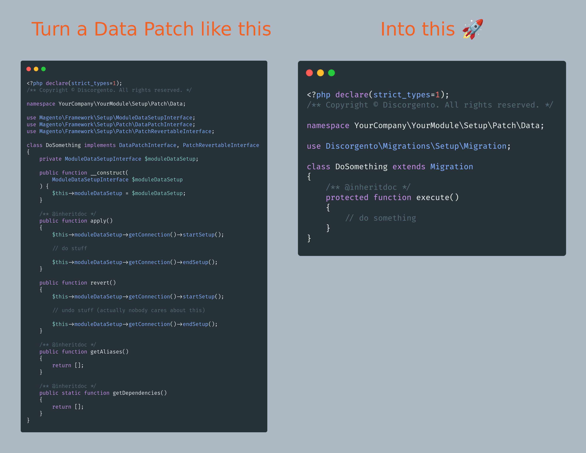

# 

<p align="center">A dev-friendly approach to keep track of database changes in Magento 2</p>
<p align="center">
    <a href="https://github.com/discorgento/module-migrations/stargazers" target="_blank"></a>
    <a href="https://packagist.org/packages/discorgento/module-migrations/stats" target="_blank"></a>
    <a target="_blank" href="https://packagist.org/packages/discorgento/module-migrations"></a>
    <a target="_blank" href="https://discorgento.com/discord"></a>
</p>

<p align="center">Sponsors</p>
<p align="center">
    <a href="https://www.caravel.com.br/"></a>
</p>

[[Install](#-Install)] [[Usage](#-Usage)] [[🎭 Facades](#-Facades)] [[Notes](#-Notes)]

Just changed something on the admin panel or on the database and now you need to replicate it again in all project environments, including other dev machines?

Magento supports [data patches](https://developer.adobe.com/commerce/php/development/components/declarative-schema/patches/) out of the box,
but writing them can get verbose and repetitive quickly. This module greatly simplifies such process.


From 50 lines to just 15, or simply 70% less code. SEVENTY percent fewer lines.
But we're just getting started.

## 📥 Install
```sh
composer require discorgento/module-migrations
```

> [!NOTE]  
> This module is compatible with Magento 2.4.6 onward, from PHP 8.1 to 8.4.

## 🛠️ Usage

### Demo

<a href="https://odysee.com/@discorgento:8/Introduction-to-Module-Migrations-Magento-discorgento-module-migrations:a"></a>  
> There's also an extended version in Brazilian Portuguese including CMS content management overview available [here](https://odysee.com/@discorgento:8/Introdu%C3%A7%C3%A3o-ao-Modulo-Migrations-Magento-discorgento-module-migrations:9).

### Basic Usage
- in the module you're developing, create a php class under its *Setup/Patch/Data/* dir;
- make it extend `Discorgento\Migrations\Setup\Migration`;
- put your logic inside the `execute()`, and run `bin/magento setup:upgrade`.

Sample data patch:

```php
<?php declare(strict_types=1);

namespace Vendor\Module\Setup\Patch\Data;

use Discorgento\Migrations\Setup\Migration;

class CmsPageMyNewPage extends Migration
{
    public function __construct(
        Migration\Context $context
    ) {
        parent::__construct($context);
    }

    protected function execute()
    {
        // your database changes logic goes here
    }
}
```

Then run:

```sh
bin/magento setup:upgrade
```

That's it, you successfully ensured that your database changes got tracked in all enviroments.

### Facades
Besides simplifying the basic data patch structure, this module also provides helpers for common Magento patch tasks, such as admin config, CMS content, and EAV attributes. Use these when your patch needs to create or update Magento data without writing the same low-level setup code every time.

See [FACADES.md](FACADES.md) for more details, shared helper methods, and the full helper reference.

## 🗒 Notes
 - create an issue in this repo to report a bug;
 - Pull Requests are welcome;
 - we want **YOU** for [our community](https://discorgento.com/discord)!
