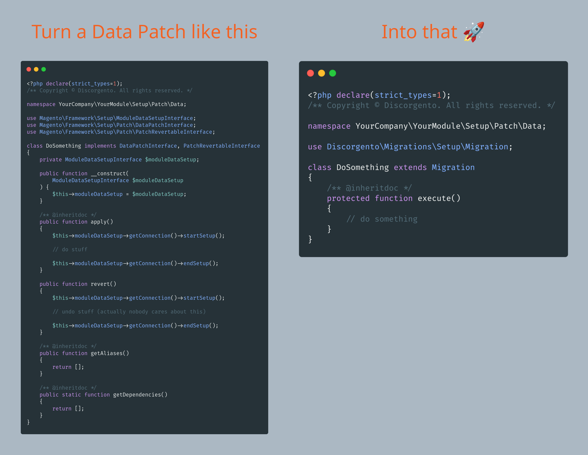

<p align="center">A dev-friendly approach to keep track of database changes in Magento 2</p>
<p align="center">
    <a href="https://github.com/discorgento/module-migrations/stargazers" target="_blank"></a>
    <a href="https://packagist.org/packages/discorgento/module-migrations/stats" target="_blank"></a>
    <a target="_blank" href="https://packagist.org/packages/discorgento/module-migrations"></a>
    <a target="_blank" href="https://discorgento.com/discord"></a>
</p>

<p align="center">Our Sponsors</p>
<p align="center">
    <a href="https://www.caravel.com.br/"></a>
</p>

## Overview 💭
Just changed something on the admin panel or on the database and now you need to replicate it again in staging and production? No worries, [we](https://discorgento.com/discord) got you covered.

Probably you already heard about [data patches](https://developer.adobe.com/commerce/php/development/components/declarative-schema/patches/), but what if I say that it can be really, really simplified?  


From 50 lines to just 15, or simply 70% less code. SEVENTY percent fewer lines.
But we're just getting started.

## Install 🔧
This module is compatible with both Magento 2.3 and 2.4, from PHP 7.3 to 8.1.
```
composer require discorgento/module-migrations:^2 && bin/magento setup:upgrade
```

## Usage 🥤
Quick demo on how to use it:  
<a href="https://odysee.com/@discorgento:8/Introduction-to-Module-Migrations-Magento-discorgento-module-migrations:a"></a>  
> There's also an extended version in Brazillian Portuguese including CMS content management overview available [here](https://odysee.com/@discorgento:8/Introdu%C3%A7%C3%A3o-ao-Modulo-Migrations-Magento-discorgento-module-migrations:9).

Besides simplifying the basic structure like showed before, we also provide some [facades](https://refactoring.guru/design-patterns/facade) to common tasks like handling [admin config](https://github.com/discorgento/module-migrations/wiki/Admin-Config), [product attributes](https://github.com/discorgento/module-migrations/wiki/Product-Attributes), [cms content](https://github.com/discorgento/module-migrations/wiki/Cms-Content) and [more](https://github.com/discorgento/module-migrations/wiki). As an example, you can use a snippet like this to create a whole new CMS Page, including Page Builder widgets on its content:

```php
<?php declare(strict_types=1);
/** Copyright © Your Company. All rights reserved. */

namespace YourCompany\YourModule\Setup\Patch\Data;

use Discorgento\Migrations\Setup\Migration;

class CmsPageMyNewPage extends Migration
{
    private Migration\Facade\CmsPage $cmsPage;

    public function __construct(
        Migration\Context $context,
        Migration\Facade\CmsPage $cmsPage
    ) {
        parent::__construct($context);
        $this->cmsPage = $cmsPage;
    }

    protected function execute()
    {
        $this->cmsPage->create('my-new-page', [
            'title' => 'Lorem Ipsum',
            'content' => <<<HTML
                <span>Hello World!</span>
            HTML,
        ]);
    }
}
```

Run a `bin/magento setup:upgrade`, navigate to the _/my-new-page path_, and that's it. And naturally as this is part of the deployment of new releases of your store, it will be automatically replicated in your integration/staging/production/whatever environments (and even your coworkers machines).

> **💡 Tip:**  Don't forget to check our [official wiki](https://github.com/discorgento/module-migrations/wiki) to make the most use of this powerful m2 tool!

## Notes 🗒
 - roadmap: create cli command to generate migrations for existant cms content (thanks [@vpjoao98](https://github.com/vpjoao98));
 - issues and PRs are welcome in this repo;
 - we want **YOU** for [our community](https://discorgento.com/discord)!
